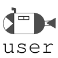

[Subuser - Securing the Linux desktop with Docker](http://subuser.org)
--------------------------

[](http://subuser.org "Visit us at subuser.org!")

[Visit us at subuser.org](http://subuser.org)
--------------------------

As free software developers we like to share.  We surf the web and discover new code.  We are eager to try it out.  We live out an orgy of love and trust, unafraid that some code we cloned from Git might be faulty or malicious.  We live in the 60s, carefree hippies.

This is utopia.

But sharing code isn't safe.  Every time we try out some stranger's script, we put ourselves at risk.  Despite the occasional claim that Linux is a secure operating system, haphazardly sharing programs is NOT secure.

Furthermore, the fragmentation of the Linux desktop means that packaging work is needlessly repeated.  Programs that build and run on Fedora must be repackaged for Ubuntu.

Subuser with Docker attacks both problems simultaneously.  Docker provides an isolated and consistent environment for your programs to run in.  Subuser gives your desktop programs access to the resources they need in order to function normally.

Subuser turns Docker containers into normal Linux programs:
------------------------------------------------------------

Right now I'm editing this file in `vim`.  `vim` is not installed on my computer though.  It is installed in a docker container.  However, in order to edit this file, all I had to do was type:

````
$ vim README.md
````

Subuser turns a docker container into a normal program.  But this program is not fully privileged.  It can only access the directory from which it was called, [not my entire home dir](http://xkcd.com/1200/).  Each subuser is assigned a specific set of permissions, just like in Android.  You can see an example `permissions.json` file bellow.

````json
{
  "description"                : "Simple universal text editor."
  ,"maintainer"                : "Timothy Hobbs <timothyhobbs (at) seznam dot cz>"
  // Path to executable within the docker image.
  ,"executable"                : "/usr/bin/vim"
  // A list of directories the program should have Read/Write access to.
  // Paths are relative to your home. Ex: "Downloads" will access "$HOME/Downloads".
  ,"user-dirs"                 : [ 'Downloads', 'Documents' ]  // Default: []
  // Allowed the program to display x11 windows.
  ,"x11"                       : true        // Default: false
  // Allow the program access to your sound playing and recording.
  ,"sound-card"                : true        // Default: false
  // Allow the program access to Read/Write access to the directory from which it was initialized.
  ,"access-working-directory" : true        // Default: false
  // Allow the program access to the internet.
  ,"allow-network-access"      : true        // Default: false
}
````

To learn more and read the full manual please visit [subuser.org](http://subuser.org)

